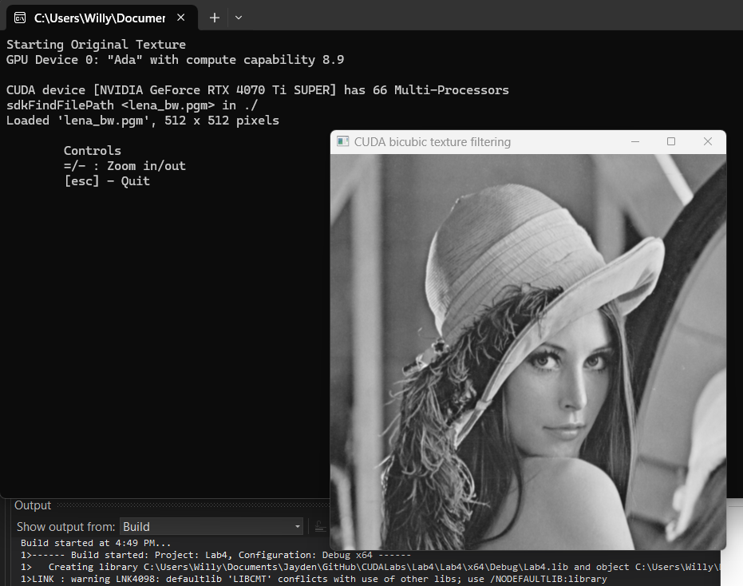
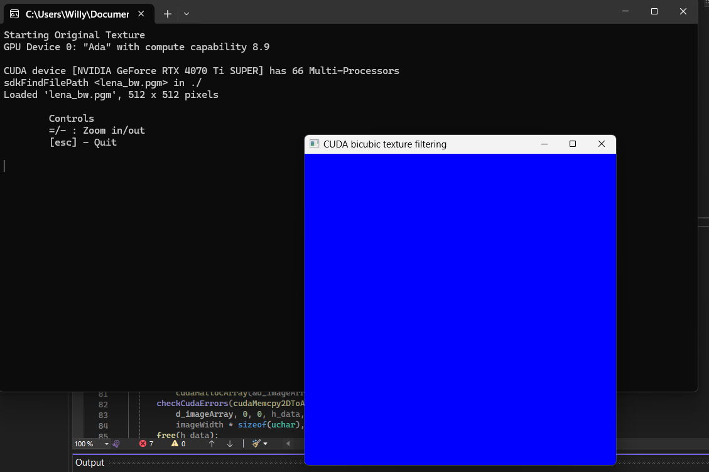
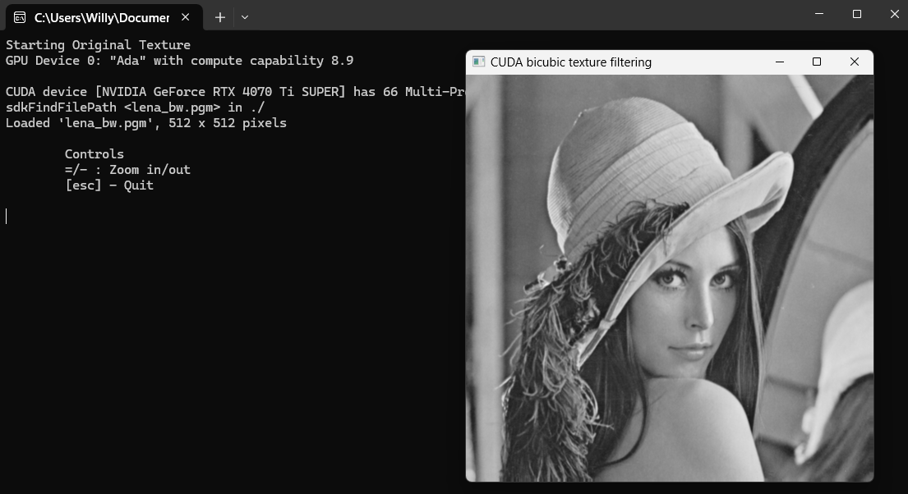
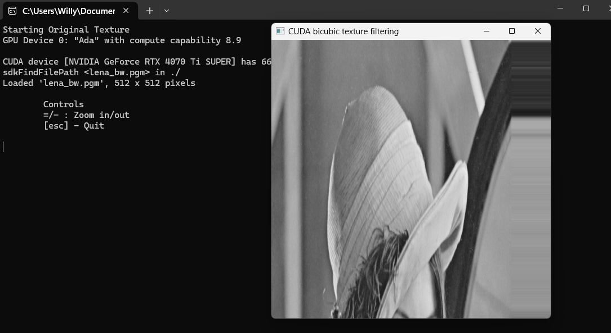
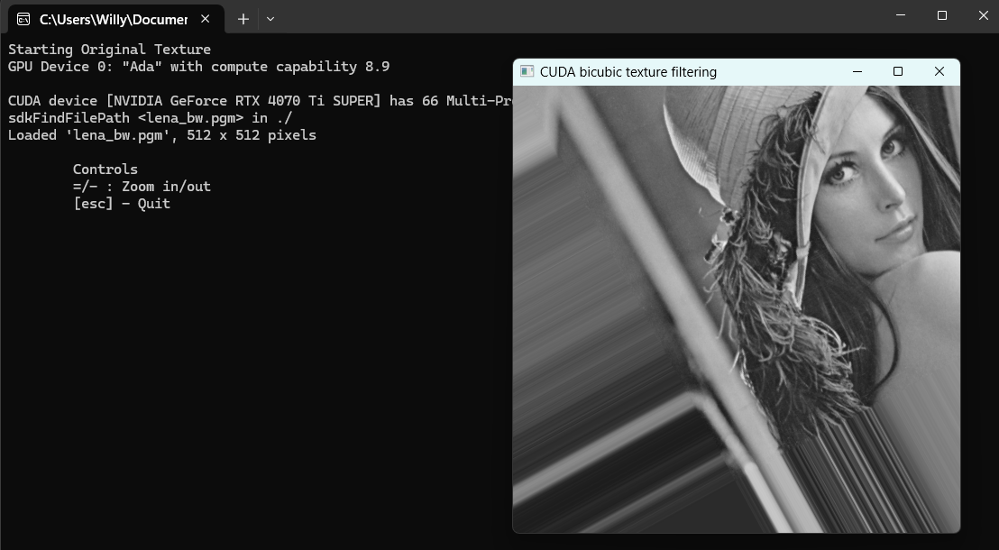
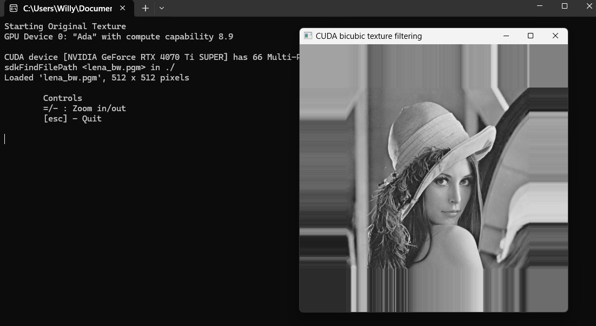
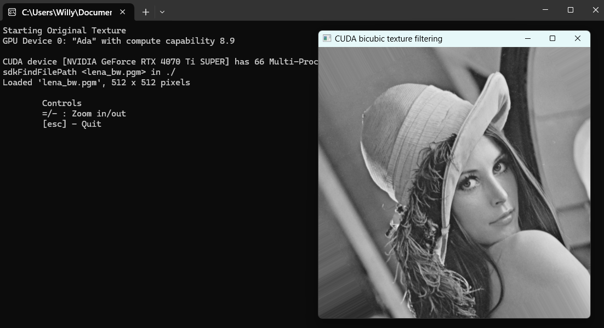

# Lab 4 

## Exercise 1

I successfully set up the development environment and was met with this black and white image of a woman with a hat on.



## Exercise 2

If we change this line: `d_output[i] = make_uchar4(c * 0xff, c * 0xff, c * 0xff, 0); `. We can alter the colour of the pixels in the image. 

`d_output[i] = make_uchar4(0xff, 0, 0, 0);`: Pure blue.

`d_output[i] = make_uchar4(0, 0xff, 0, 0);`: Pure green.

`d_output[i] = make_uchar4(0, 0, 0xff, 0);`: Pure red.

```cpp

if ((x < width) && (y < height)) {
    // write output color
    float c = tex2D<float>(texObj, u, v);

    // standard image
    // d_output[i] = make_uchar4(c * 0xff, c * 0xff, c * 0xff, 0);

    // pure green
    // d_output[i] = make_uchar4(0, 0xff, 0, 0);

    // pure red
    // d_output[i] = make_uchar4(0, 0, 0xff, 0);

    // pure blue
	// d_output[i] = make_uchar4(0xff, 0, 0, 0);

}

```

This does not do much for us, but here is an image of it in pure blue:



## Exercise 3

### Translate

Here I altered our `d_render()` function for translation:

```cpp

__global__ void d_render(uchar4* d_output, uint width, uint height, float tx,
    float ty, float scale, float cx, float cy,
    cudaTextureObject_t texObj) {

    // lecturer says no
    // uint x = __umul24(blockIdx.x, blockDim.x) + threadIdx.x;
    // uint y = __umul24(blockIdx.y, blockDim.y) + threadIdx.y;
    // uint i = __umul24(y, width) + x;

    // basically is the same before
	// the umul24() function is an optimisation for multiplaction of 24-bit integers
    // it is mainly for older GPUs i believe

    uint x = blockIdx.x * blockDim.x + threadIdx.x;
    uint y = blockIdx.y * blockDim.y + threadIdx.y;
    uint i = y * width + x;

    // translation stuff
    float2 T = { 20, 10 };
    float u = x + T.x;
    float v = y + T.y;

    // original lines without translation
    // float u = (x - cx) * scale + cx + tx;
    // float v = (y - cy) * scale + cy + ty;

    if ((x < width) && (y < height)) {
        // write output color
        float c = tex2D<float>(texObj, u, v);

        // standard image
        d_output[i] = make_uchar4(c * 0xff, c * 0xff, c * 0xff, 0);

        // pure green
        // d_output[i] = make_uchar4(0, 0xff, 0, 0);

        // pure red
        // d_output[i] = make_uchar4(0, 0, 0xff, 0);

        // pure blue
		// d_output[i] = make_uchar4(0xff, 0, 0, 0);

    }
}

```

In this case, we are translated the image 20 pixels to the right, and 10 pixels down. This is because we are sampling from a position further to the right and down in the texture.



### Scale

If we were to scale the image, this is the code we would use:

```cpp

uint x = blockIdx.x * blockDim.x + threadIdx.x;
uint y = blockIdx.y * blockDim.y + threadIdx.y;
uint i = y * width + x;

// translate image
// float2 T = { 20, 10 };
// float u = x + T.x;
// float v = y + T.y;

// scale image
float2 S = { 1.2, 0.5 };
float u = x * S.x;
float v = y * S.y;

// original lines without any sorcery
// float u = (x - cx) * scale + cx + tx;
// float v = (y - cy) * scale + cy + ty;

```

This stretches the image by a factor of 1.2, and compresses it by 0.5, making it look all squashed.



### Rotate

If we were to rotate the image:

```cpp

// rotate image
float angle = 0.5;
float u = x * cos(angle) - y * sin(angle);
float v = x * sin(angle) + y * cos(angle);

```

This rotates it by a half a radian (28.64 degrees).




### Scale by Position (Center)

If we were to scale the image by its center:

```cpp

// scale by position
float s = 1.5;
float centerx = width / 2; // center x
float centery = height / 2; // center y
float u = (x - centerx) * s + centerx;
float v = (y - centery) * s + centery;

```

This will scale the image down by a factor of 1.5x from the center of the image. I had to change some variables name or it would not compile.



### Roate by Position (Center)

if we were to rotate the image by its center:

```cpp

// roate by image center
float angle = 0.5;
float centerx = width / 2; 
float centery = height / 2;

float dx = x - centerx;
float dy = y - centery;

float u = cos(angle) * dx - sin(angle) * dy + centerx;
float v = sin(angle) * dx + cos(angle) * dy + centery;

```

This will rotate the image by half a radian from its center.



## Lab 4 Reflection

I originally tried doing this Lab in VSCode instead of Visual Studio because I do not really like the extra clunk Visual Studio brings with it, aswell as because I think it obfuscates a lot of the process of developing. This was the first lab where the hassle of setting things up properly in VSCode outweighed me just using Visual Studio and I am thankful I did in the end. I enjoyed seeing what these matrix multiplications we have been doing in previous labs affect images, acting as a literal visual representation of our code. Although fairly simple and straightforward, I believe it has laid essential groundwork in developing in CUDA. I much prefer having a visual element when I am programming, so it will be fun to finally really understand how algorithms like image sharpening, different types of blur (etc.) really work. It is only slightly annoying I have an AMD card. I've opted to use a markdown to PDF converter for this lab also, as I think the images will format a lot nicer, I apologise for any unforseen formatting issues because of this process. 

