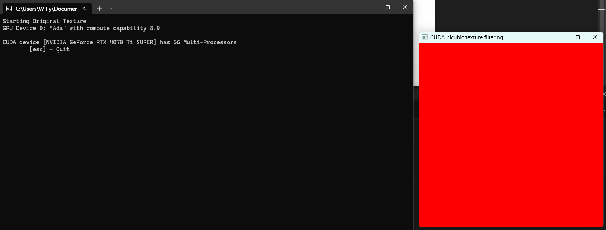
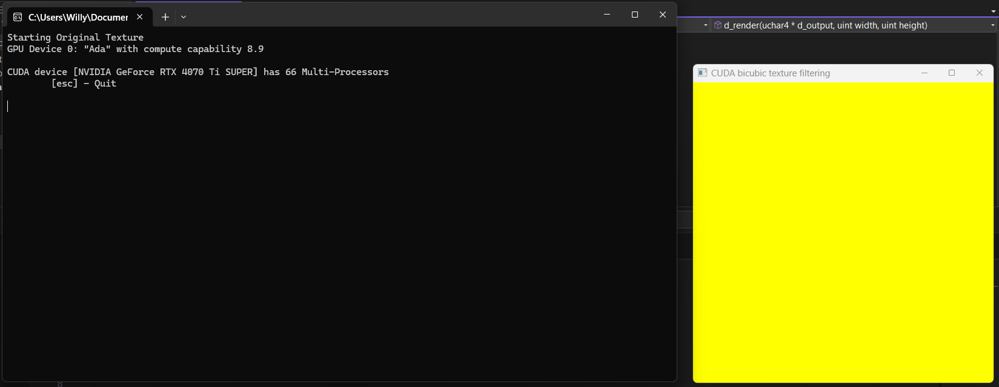
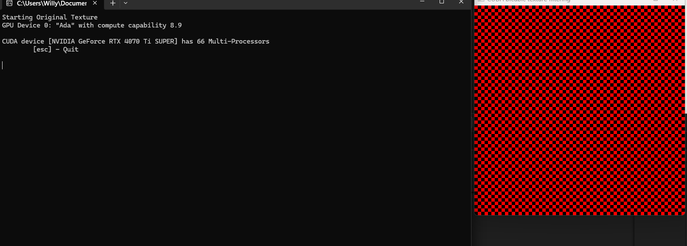
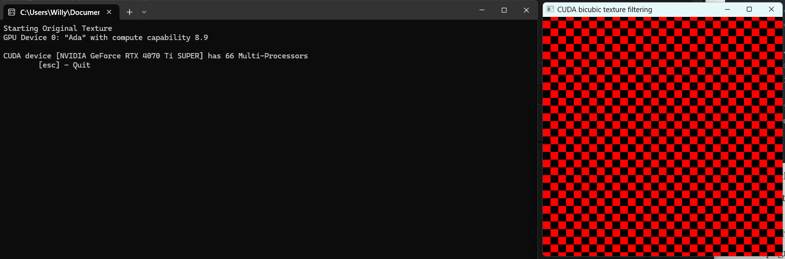
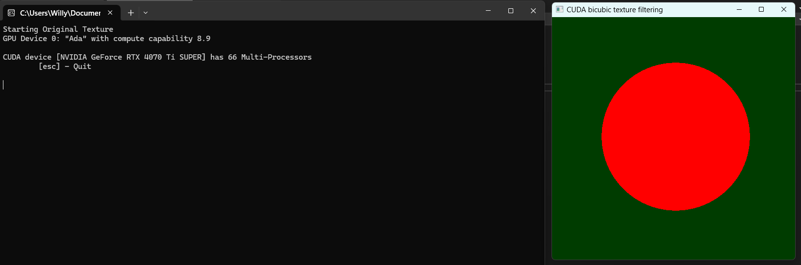
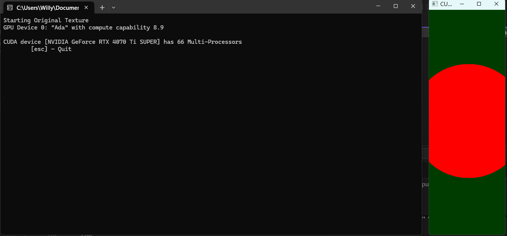
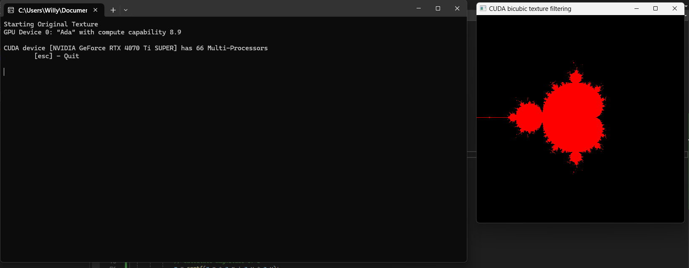
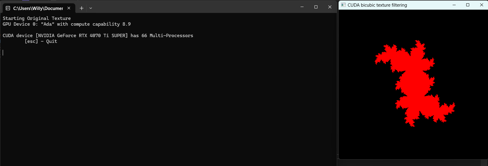

# Lab 6

## Exercise 1

I got it running and working, seeing just a red square:



I altered this line `d_output[i] = make_uchar4(0, 0, 0xff, 0);` to this: `d_output[i] = make_uchar4(0, 0xff, 0xff,  0);` and it gave me a pretty yellow square:



## Exercise 2

There are two ways to make this checkerboard pattern here, a conditional and a mathematical approach. The conditional approach is the one I first resonated with, while the mathematical approach more closely follows the `makeCheckImage()` file.

### Conditional

```cpp
__global__ void d_render(uchar4* d_output, uint width, uint height) {
    uint x = __umul24(blockIdx.x, blockDim.x) + threadIdx.x;
    uint y = __umul24(blockIdx.y, blockDim.y) + threadIdx.y;
    uint i = __umul24(y, width) + x;

    if ((x < width) && (y < height)) {
        if (((x & 0x8) == 0) ^ ((y & 0x8) == 0)) {
            d_output[i] = make_uchar4(0, 0, 0xff, 0);
        }
        else {
            d_output[i] = make_uchar4(0, 0, 0, 0);
        }
    }
}
```

This version is uses an if-else statement to colour every other block, starting with red, and alternating black. I believe this is more readable but less concise.

### makeCheckImage() version

```cpp
__global__ void d_render(uchar4* d_output, uint width, uint height) {
    uint x = __umul24(blockIdx.x, blockDim.x) + threadIdx.x;
    uint y = __umul24(blockIdx.y, blockDim.y) + threadIdx.y;
    uint i = __umul24(y, width) + x;

    if ((x < width) && (y < height)) {
        unsigned char c = ((((x & 0x8) == 0) ^ ((y & 0x8) == 0))) * 255;
        d_output[i] = make_uchar4(0, 0, c, 0);
    }
}
```

This version is more concise, calculating that the variable `c` is either 0 or 255 based on the checkerboard logic. This works because black is `(0, 0, 0, 0)` and red is `(0, 0, 255, 0)`. This version is not only more conciose but very slightly more performant because it avoids branching.

### Output

Both of these have the same output:



To enlargen the square, we change this line `unsigned char c = ((((x & 0x8) == 0) ^ ((y & 0x8) == 0))) * 255;` to this `unsigned char c = ((((x & 0x8) == 0) ^ ((y & 0x8) == 0))) * 255;`. This modifies the bit mask, the higher the bit mask value, the larger the squares will be.



To make a red circle with a dark green background, we need to modify the code further. First we have the find the center of the frame, from there we can iterate through each pixel and check the distance from the center. If it is below a certain distance, that pixel is red. If not, that pixel is slightly greenish:

```cpp
__global__ void d_render(uchar4* d_output, uint width, uint height) {
    uint x = __umul24(blockIdx.x, blockDim.x) + threadIdx.x;
    uint y = __umul24(blockIdx.y, blockDim.y) + threadIdx.y;
    uint i = __umul24(y, width) + x;

    if ((x < width) && (y < height)) {
        // calculate center
        float centerX = width / 2.0f;
        float centerY = height / 2.0f;

        // calculate a given pixels disance from the center
        float dx = x - centerX;
        float dy = y - centerY;
        float distance = sqrtf(dx * dx + dy * dy);

        float radius = min(width, height) * 0.3f;

        // set colour based on distance
        if (distance <= radius) {
            // red circle
            d_output[i] = make_uchar4(0, 0, 0xff, 0);
        }
        else {
            // like a greenish background from the brief image (60 seems about right)
            d_output[i] = make_uchar4(0, 60, 0, 0);
        }
    }
}
```



We can take this further by drawing it based on pixel coordinates (-1, -1 - 1, 1). To avoid distortion we can scale the u-coordinate using window aspect ratio. The code here is appropraited from the brief.

```cpp
__global__ void d_render(uchar4* d_output, uint width, uint height) {
    uint x = __umul24(blockIdx.x, blockDim.x) + threadIdx.x;
    uint y = __umul24(blockIdx.y, blockDim.y) + threadIdx.y;
    uint i = __umul24(y, width) + x;

    if ((x < width) && (y < height)) {
		// normalise coords to -1, 1
        float u = x / (float)width;
        float v = y / (float)height;
        u = 2.0f * u - 1.0f;
        v = -(2.0f * v - 1.0f);

		// the brief only specifies to adjust the u coord
        u *= width / (float)height;
    
        float distance = sqrtf(u * u + v * v);

        // set colour based on distance from the center
        if (distance <= 0.5f) {
            // red circle
            d_output[i] = make_uchar4(0, 0, 0xff, 0);
        }
        else {
            // greenish backround
            d_output[i] = make_uchar4(0, 60, 0, 0);
        }
    }
}
```



As you can see, the circle retains its size even when squashed horizontally.

## Exercise 3

### Mandelbrot Set

The final goal for any shape, no matter how complex it is in the brief, is deciding whether each pixel is or is not meant to be part of the shape. Using the Python code from the brief, we are able to translate it into some nice C++ Cuda code. 

```cpp
__global__ void d_render(uchar4* d_output, uint width, uint height) {
    uint x = __umul24(blockIdx.x, blockDim.x) + threadIdx.x;
    uint y = __umul24(blockIdx.y, blockDim.y) + threadIdx.y;
    uint i = __umul24(y, width) + x;

    if ((x < width) && (y < height)) {
        // normalise to 1, -1
        float u = x / (float)width;
        float v = y / (float)height;
        u = 2.0f * u - 1.0f;
        v = -(2.0f * v - 1.0f);

        // scale coords to 2, -2 to zoom in rather than 4, -4
        u *= 2.0f;
        v *= 2.0f;

		// mandelbrot set
        float2 z = make_float2(u, v);
        float2 c = z; 
        float r = 0.0f;
        float color = 1.0f;

        // iterate 30 times (given by the lab pseudocode)
        for (int j = 0; j < 30; j++) {
            // z = z^2 + c
            float2 z_squared = make_float2(z.x * z.x - z.y * z.y, 2.0f * z.x * z.y);
            z = make_float2(z_squared.x + c.x, z_squared.y + c.y);

			// calculate magnitude of z
            r = sqrtf(z.x * z.x + z.y * z.y);

			// if magnitude of z is greater than 5, the pixel is not in the set
            if (r > 5.0f) {
                color = 0.0f;
                break;
            }
        }

		// set pixel colour based on if its in the set or not
        if (color > 0.0f) {
            // pixels in the set are red
            d_output[i] = make_uchar4(0, 0, 0xff, 0);
        }
        else {
            // pixels that are not are in black
            d_output[i] = make_uchar4(0, 0, 0, 0);
        }
    }
}
```



### Julia Set

Simarly to the Mandelbrot, we can take the given Python code and 'translate' it to C++ Cuda code:

```cpp
__global__ void d_render(uchar4* d_output, uint width, uint height) {
    uint x = __umul24(blockIdx.x, blockDim.x) + threadIdx.x;
    uint y = __umul24(blockIdx.y, blockDim.y) + threadIdx.y;
    uint i = __umul24(y, width) + x;
    if ((x < width) && (y < height)) {

        // normalise to 1, -1
        float u = x / (float)width;
        float v = y / (float)height;
        u = 2.0f * u - 1.0f;
        v = -(2.0f * v - 1.0f);

        // scale coords to 2, -2 to zoom in rather than 4, -4
        u *= 2.0f;
        v *= 2.0f;

        // julia set
        float2 z = make_float2(u, v);

        // For Julia set, c is fixed rather than being the starting point
        float2 c = make_float2(0.25f, 0.5f);

        float r = 0.0f;
        float color = 1.0f;

        // iterate 30 times (given by the lab pseudocode)
        for (int j = 0; j < 30; j++) {
            // z = z^2 + c
            float2 z_squared = make_float2(z.x * z.x - z.y * z.y, 2.0f * z.x * z.y);
            z = make_float2(z_squared.x + c.x, z_squared.y + c.y);

            // calculate magnitude of z
            r = sqrtf(z.x * z.x + z.y * z.y);

            // if magnitude of z is greater than 5, the pixel is not in the set
            if (r > 5.0f) {
                color = 0.0f;
                break;
            }
        }
        // set pixel colour based on if its in the set or not
        if (color > 0.0f) {
            // pixels in the set are red
            d_output[i] = make_uchar4(0, 0, 0xff, 0);
        }
        else {
            // pixels that are not are in black
            d_output[i] = make_uchar4(0, 0, 0, 0);
        }
    }
}
```



Both of these turned out great and I am happy with the result.


## Lab 6 Reflection

I enjoyed this lab, especially the section where we were tasked to render the cool fractals. I noticed at the start of exercise 3 that for the circle section of exercise 2, the circle background is actually meant to be black and not a dark green. Obviously that did not affect much but I thought it was worth mentioning as to not cause confusion. I feel like I have become a lot better at manipulating specific pixels within images in this lab. It makes me excited to figure out more complex shapes or even try to code different effects (Gaussian blur, Anti-Aliasing etc.). I am also unsure whether or not I made the right call at the start of task 2 by selecting the method that most closely resembled the given psuedocode, but I think I was correct.
  
